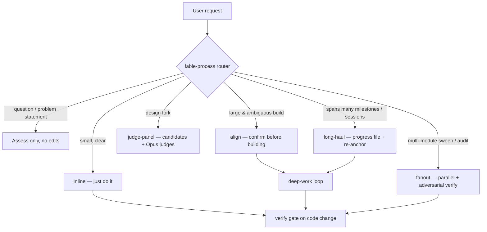

# fable-process

> Unofficial community plugin. Not affiliated with or endorsed by Anthropic.

**Fable-style discipline for any Claude model.** When Claude Fable 5 is
unavailable — or you're running Opus or Sonnet — this plugin keeps its *process*:
outcome-driven autonomy, parallel fan-out with adversarial verification, minimal
diffs, and evidence-grounded reporting.

```
/plugin marketplace add choym92/fable-process
/plugin install fable-process@fable-process
/fable-process:setup          # once per machine
/output-style fable-process   # or "outputStyle": "fable-process" in settings
```

## The idea

Fable 5's "way of working" turns out to be mostly reproducible machinery, not
model magic. It is already written down in three places:

1. **Anthropic's official [Prompting Claude Fable 5](https://platform.claude.com/docs/en/build-with-claude/prompt-engineering/prompting-claude-fable-5)
   guide** — publishes the exact prompt fragments that produce the behavior
   (minimal diff, evidence-audited reporting, never ending a turn on a promise).
2. **Claude Code's harness internals** — the system prompt imposes discipline
   rules on whatever model runs; the strictest ones (run-don't-read verification,
   faithful outcome reporting, comment restraint) ship behind an internal-only
   flag that ordinary accounts never receive.
3. **Claude Code's extension system** — output styles, skills, subagents, and
   hooks are model-agnostic and available to everyone.

fable-process transplants (1) and (2) into (3). Fable may close; the Fable way of
working remains.

**What this does NOT do.** Fable 5 and Opus are different models (Fable 5 shares
its underlying model only with Mythos 5, a tier above Opus). This plugin
transplants the *process* — the discipline, procedures, and enforcement — not the
reasoning ceiling. On Opus, expect the same workflow with more iterations and
shorter reliable autonomous stretches. That is exactly why the deterministic
pieces (the verify gate, the adversarial verifier) matter more here than they
would on Fable.

## How it works

One always-on layer, three lazy layers:

| Layer | Mechanism | Context cost | Role |
|---|---|---|---|
| Output style | system-prompt injection | ~550 tok while active | The disposition — act-don't-ask, minimal diff, evidence-grounded reports — and routes big work to the skills |
| Skills (5) | auto-invoke on matching situations, or `/fable-process:<name>` | 1 line each idle; body only on invoke | The procedures: `align`, `fanout`, `deep-work`, `judge-panel`, `setup` |
| Agents (4) | delegated subagent workers | only when used | Tiered cost: Sonnet (`explorer`, `worker`) does the work, Opus xhigh (`verifier`, `judge`) judges it |
| Hook | shell script on Stop / SubagentStop | 0 tok | Deterministic enforcement: edited-but-unverified → one nudge to verify |

Drive it with nothing (auto-routing), or explicitly: `ultrathink` in any prompt
for one-turn deep reasoning (the only thinking keyword the harness still honors),
`ultracode` for orchestrated multi-agent workflows, or the slash commands.

| Piece | What it does |
|---|---|
| `skills/align` | pre-build alignment — one question at a time, answers from the codebase first, no implementation until shared understanding |
| `skills/fanout` | decompose → parallel Sonnet workers → capped Opus adversarial verify → synthesize |
| `skills/deep-work` | verifiable done-conditions, loop until they hold, fresh-context self-checks on long runs |
| `skills/long-haul` | hold coherence over hours/multi-session runs — durable progress file, re-anchor after context growth, commit checkpoints |
| `skills/debrief` | close the comprehension gap — HTML report of what changed (context, intuition, work) ending in a quiz you must pass |
| `skills/refine` | harness garbage collection — turn each session's friction (gate blocks, corrections, "continue" nudges) into durable rules |
| `skills/insights` | insight ledger for analysis work — curated INSIGHTS.md so findings survive context bloat and session ends |
| `skills/scaffold` | bootstrap a project's harnessed environment — .fable/ docs, tagged pointer-based WORKLOG convention, per-domain agents that read & maintain it |
| `hooks/session-log-commit.sh` | SessionEnd safety net: auto-commits `.fable/` + CLAUDE.md (harness docs ONLY, never source) so session logs survive |
| `scripts/fable-relay.sh` | Ralph-style fresh-context relay: headless sessions complete one milestone each until a DONE sentinel (hard iteration cap) |
| `skills/judge-panel` | independent candidates → Opus judges hunting failure modes → synthesis |
| `agents/verifier` | refuter: "reading is not verification — run it"; guards against verification avoidance and first-80% seduction |
| `workflows/fanout.js` | reference workflow script — run via `Workflow({scriptPath})` or copy to `~/.claude/workflows/` |
| `hooks/verify-gate.sh` | turn-scoped Stop gate, fails open, blocks at most once |

## The research behind it

This plugin was not designed from intuition (2026-07-08):

- **Two deep-research workflow runs (~200 subagents)** swept Anthropic docs,
  Reddit, GitHub, and engineering blogs; every surviving claim passed 3-0
  adversarial verification against live primary sources.
- **A source-level audit of Claude Code's internals** extracted the ten most
  load-bearing behavioral rules the harness imposes on its model.
- **The plugin itself was red-teamed** by independent agents: six
  empirically-confirmed defects in v0.2 — hook false-blocks from stale turns, an
  unbounded Opus verification path — were found by executing the hook against
  synthetic transcripts, then fixed and re-tested 10/10 in v0.3.

## Findings → design

| Verified finding | Where it landed |
|---|---|
| Official anti-over-engineering fragment: "Don't add features, refactor, or introduce abstractions beyond what the task requires" | style · Minimal diff |
| Official evidence-audit fragment — "nearly eliminated fabricated status reports" in Anthropic's testing | style · Evidence-grounded reporting |
| Official early-stopping fix — never end a turn on a plan, question, or promise | style · Act, then keep acting |
| CLAUDE.md is advisory; hooks are deterministic (official best practices) | `verify-gate` on Stop + SubagentStop |
| Fresh-context verifiers outperform self-critique (official) | `verifier` agent + deep-work self-check interval |
| Harness internals: "reading is not verification — run it"; failure modes named "verification avoidance" and "first-80% seduction" | `verifier` system prompt |
| Harness internals: brief subagents like "a colleague who just walked in"; delegate context, never understanding | `explorer`/`worker` briefs + style · Delegation |
| One-question-at-a-time alignment interviews (à la Matt Pocock's grilling loop) | `align` skill (original implementation) |
| Fable dispatches parallel subagents readily; prefer async orchestration (official) | `fanout` skill + workflow script |
| "Skills for prior models are often too prescriptive for Fable 5" (official) | plugin targets Opus and below; switch the style off on Fable-class models |
| Community: unbounded auto fan-out burns tokens (fable-mode, TDD Guard, hooks-mastery precedents) | default-deny scale guards; workflow hard-caps Opus verification at 20 |

Token accounting (measured with `claude plugin details`): ~530 tokens always-on,
~550 while the style is active. Skill bodies load only on invocation; hooks and
the workflow script cost zero model context.

## Scenarios

The router (the output style) sends each request to the lightest thing that fits.
Only the "large & ambiguous" path asks you questions up front; elsewhere it acts and
reports, pausing only for destructive, out-of-scope, or user-only decisions. Any path
that changes code passes the verify gate before finishing.



| Request looks like | Goes to | You get asked? |
|---|---|---|
| small, unambiguous | inline | no |
| a question / "what do you think" | assess only | no (won't edit) |
| big and under-specified | `align` | yes — one question at a time |
| "audit / sweep everything" | `fanout` | no (announces cost if >~10 agents) |
| "which approach should we…" | `judge-panel` | no (recommends, doesn't menu) |
| multi-day / multi-session build | `long-haul` | only at real checkpoints |

## How to prompt with it

Two habits from Anthropic's official guidance multiply what the plugin does:

- **Give the reason, not only the request.** Intent lets the model connect the
  task to relevant context instead of guessing:
  `I'm working on [the larger task] for [who it's for]. They need [what the
  output enables]. With that in mind: [request].`
  (The `align` skill will ask for the missing "why" on large builds, but leading
  with it saves the question.)
- **Use the keywords deliberately.** `ultrathink` = one-turn deep reasoning;
  `ultracode` = orchestrated multi-agent workflows; effort stays at your
  configured level otherwise.

## The automation layer

Three loops, from tightest to widest (patterns from OpenAI's harness-engineering
practice and the Ralph loop):

1. **In-session** — deep-work's done-conditions loop; the Stop gate as the floor.
2. **Across sessions** — long-haul relay mode: `scripts/fable-relay.sh` runs
   fresh headless sessions, one verified milestone each, until `.fable/DONE`.
   Fresh context per milestone beats one compaction-eroded mega-session. Capped
   iterations by default; every "continue" you ever have to type is harness
   friction, not a fact of life.
3. **On the harness itself** — `/fable-process:refine` is garbage-collection day
   as a command: harvest the week's friction, encode each event as a durable
   rule in its right home (style / skill guard / gate pattern / project
   CLAUDE.md), version-bump, push. Because the plugin is one git repo installed
   everywhere, a fix lands globally with a single `plugin update`.

Per-project layer (created by `scaffold`, maintained by the domain agents it
generates): `.fable/WORKLOG.md` — one tagged entry per significant session,
pointers only (commit SHAs, paths, INSIGHTS refs — the anti-bloat rule: point,
don't restate); `.fable/INSIGHTS.md` — the analysis ledger; domain agents
(data-engineering / analysis / frontend / backend) whose first action is reading
those docs and whose last action is updating them. The judgment half (what to
log) is the model's job in-session; the SessionEnd hook is the mechanical safety
net that commits it.

## Update

```
claude plugin marketplace update fable-process        # refresh the repo clone
claude plugin update fable-process@fable-process      # update the plugin
/fable-process:setup   # re-sync the output style (shows a diff if changed)
```

Restart the session after updating. Skills/agents/hooks apply automatically; only
the output style needs the setup re-run.

## Auto-invocation & cost control

Skills are fully auto-invocable by design (Fable-like proactivity): Claude routes
large ambiguous builds to `align`, big decomposable work to `fanout`, multi-step
implementation to `deep-work`, and design forks to `judge-panel` on its own. The
counterweight is each skill's scale guard — small tasks stay inline, fan-out is
default-deny (one explorer scouts first when breadth is unproven), only
load-bearing findings get Opus verification, and plans above ~10 agents are
announced with cost before launch.

## Requirements & notes

- Claude Code >= 2.1.154 (dynamic workflows); >= 2.1.198 recommended (background
  subagents by default). Workflows may need enabling in `/config` on some plans.
- Output styles can't ship inside plugins (a plugin-system limitation), hence the
  `setup` skill copies it to `~/.claude/output-styles/`.
- The verify gate checks that a verification command ran, not that it succeeded —
  honest failure reporting is the output style's job. It fails open and blocks at
  most once per stop.
- The output style is language-neutral (English). To pin a response language, add
  a one-line Language section to your copy in `~/.claude/output-styles/`.

MIT — see [LICENSE](LICENSE).
